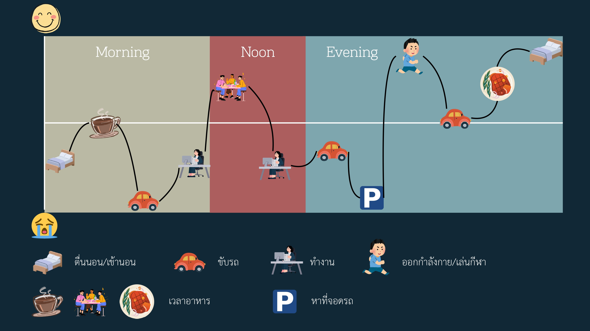

## 6. User Journey Map: ศูนย์กีฬา (ข้าง มจธ.)
**รูปแบบการวิเคราะห์:** Persona-Based Journey Mapping (First – Next – Then)
 
### Persona 1: ลุงนักวิ่ง
*ประเด็นหลัก: ความสะดวกในการซ้อมวิ่ง และความพึงพอใจต่อการเปลี่ยนแปลงของสนาม*
 
| ขั้นตอน | รายละเอียด |
|---|---|
| **1. First** | **ความรู้สึก:** พึงพอใจและสบายใจในการเลือกสถานที่ • **การกระทำ:** เดินทางมาซ้อมวิ่งเป็นประจำเพราะอยู่ใกล้บ้าน สะดวกกว่าเดินทางไปสวนธนบุรีรมย์ที่ไกลและทางวิ่งแคบ |
| **2. Next** | **จุดดรอป:** หงุดหงิดเล็กน้อยกับที่จอดรถที่มีน้อยและรถสวนไปมา • **จุดพีค:** ประทับใจสภาพแวดล้อมปัจจุบันมาก หลังเปลี่ยนผู้ดูแลสนามใหม่ที่ยกเลิกตลาดนัดแล้วเน้นจัดแข่งขันกีฬาแทน ทำให้ไม่มีร้านค้ามาเกะกะพื้นที่วิ่ง |
| **3. Then** | มองว่าศูนย์กีฬาปัจจุบันลงตัวมาก ไม่มีอะไรที่ไม่ดี และจะยังคงเลือกมาออกกำลังกายที่นี่ต่อไปเป็นหลัก |
 
### Persona 2: อาจารย์เกษียณ
*ประเด็นหลัก: สภาพแวดล้อมที่โปร่งสบาย และปัญหาการจราจรช่วงมีงานแข่ง*
 
| ขั้นตอน | รายละเอียด |
|---|---|
| **1. First** | **ความรู้สึก:** ผ่อนคลาย เดินทางมาออกกำลังกายตามกิจวัตร • **การกระทำ:** เลือกมาที่นี่เพราะใกล้บ้าน ไม่ต้องเดินไกลเหมือนไปสวนธนบุรีรมย์ (เพิ่มอีก 400 เมตร) และชอบพื้นที่กว้างขวาง โล่งสบาย ไม่ทึบหรือมีต้นไม้เยอะเกินไป |
| **2. Next** | **จุดดรอป (Core Pain Point):** อารมณ์เสียและลำบากเรื่องหาที่จอดรถยากมาก โดยเฉพาะวันที่มีงานแข่งขัน • **จุดพีค:** สบายใจและผ่อนคลายเมื่อได้ออกกำลังกายในพื้นที่กว้างและบรรยากาศโปร่งสบาย |
| **3. Then** | มองว่าเป็นสถานที่ที่ดีมากและตอบโจทย์การพักผ่อน แต่เสนอให้จัดระบบที่จอดรถให้ดีกว่านี้ในช่วงมีงานแข่ง |
 
### Persona 3: คุณแม่
*ประเด็นหลัก: การพาลูกมาเรียนว่ายน้ำเพื่อพัฒนาการ และปัญหาที่จอดรถไม่เพียงพอ*
 
| ขั้นตอน | รายละเอียด |
|---|---|
| **1. First** | **ความรู้สึก:** มุ่งมั่นและตั้งใจดีในการส่งเสริมพัฒนาการของลูก • **การกระทำ:** พาลูกมาเรียนว่ายน้ำที่สระมาตรฐานโอลิมปิก เพราะใกล้บ้าน โดยหวังให้ลูกแข็งแรงและฝึกสมาธิ |
| **2. Next** | **จุดดรอป (Core Pain Point):** เครียดและหงุดหงิดกับปัญหาที่จอดรถหายากและไม่เพียงพอ • **จุดพีค:** ชื่นชมคุณภาพสิ่งอำนวยความสะดวก โดยเฉพาะสระว่ายน้ำมาตรฐานโอลิมปิกที่ช่วยให้ลูกเรียนและฝึกสมาธิได้เต็มที่ |
| **3. Then** | มองว่าโดยรวมทุกอย่างลงตัวและตอบโจทย์ครอบครัว ยกเว้นเรื่องที่จอดรถที่อยากให้เพิ่มจำนวนช่องจอด |
 
### Persona 4: เด็กที่วินชาร์จ
*ประเด็นหลัก: สภาพสนามฟุตบอล และข้อจำกัดเรื่องสภาพอากาศ (แดด/ฝน)*
 
| ขั้นตอน | รายละเอียด |
|---|---|
| **1. First** | **ความรู้สึก:** ตื่นเต้น สนุกสนาน มุ่งมั่นจะมาเตะฟุตบอลกับเพื่อน • **การกระทำ:** เดินทางมาเพื่อเล่นฟุตบอลเป็นหลัก โดยไม่ได้ให้ความสำคัญกับสิ่งอำนวยความสะดวกส่วนอื่นมากนัก |
| **2. Next** | **จุดดรอป:** เล่นฟุตบอลลำบากและเหนื่อยสะสม เพราะช่วงกลางวันแดดร้อนจัดจนเตะไม่ได้ และฝนตกก็เปียกปอนเพราะสนามไม่มีหลังคา • **จุดพีค:** สนุกสนานกับการได้เตะฟุตบอลและทำกิจกรรมร่วมกับเพื่อน ๆ |
| **3. Then** | มองว่าภาพรวมของศูนย์กีฬาโอเคแล้ว แต่มีข้อเสนอแนะหลักคือ **อยากให้ทำโดมหลังคาครอบสนามฟุตบอลขนาดทีมละ 7 คน** เพื่อให้เล่นได้ทุกสภาพอากาศ |
 
### Persona 5: เด็กโรงเรียนคิม
*ประเด็นหลัก: ผู้ใช้บริการรายใหม่ และความสับสนเรื่องสัญลักษณ์จุดจอดรถ*
 
| ขั้นตอน | รายละเอียด |
|---|---|
| **1. First** | **ความรู้สึก:** แปลกใหม่และยังไม่คุ้นชินกับสถานที่ (พึ่งมาใช้บริการได้ 3 วัน วันที่สัมภาษณ์คือวันอาทิตย์) |
| **2. Next** | *(เอกสารต้นฉบับยังไม่ได้ระบุรายละเอียดจุดพีค/จุดดรอปของ Persona นี้)* |
| **3. Then** | *(เอกสารต้นฉบับยังไม่ได้ระบุ)* |

---