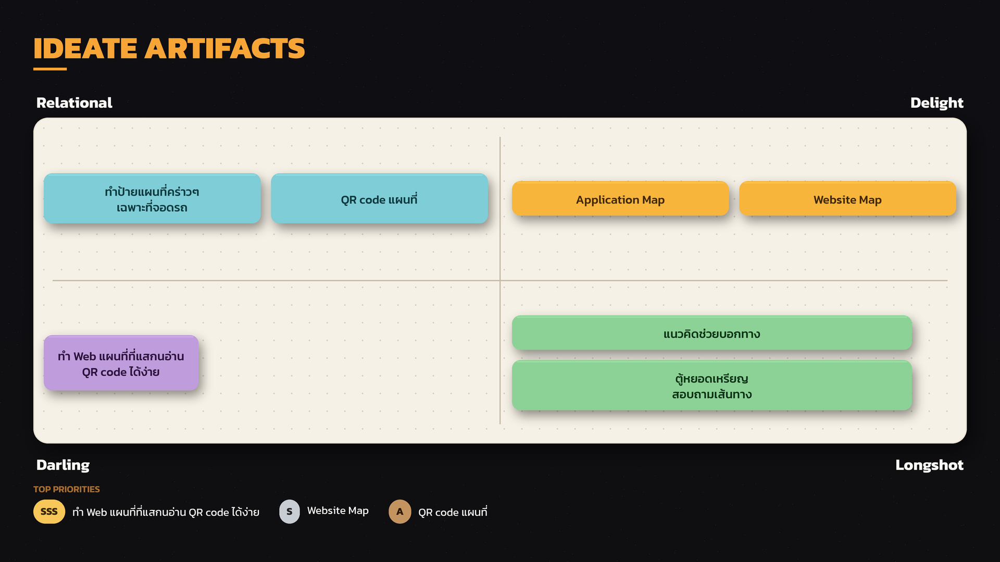
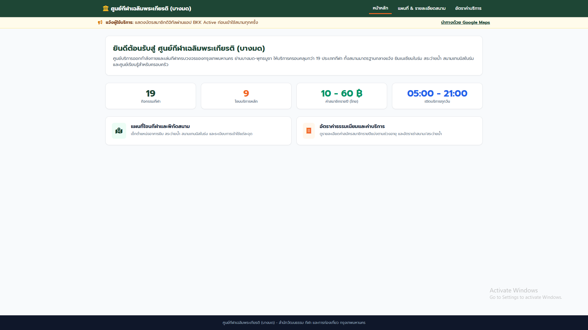
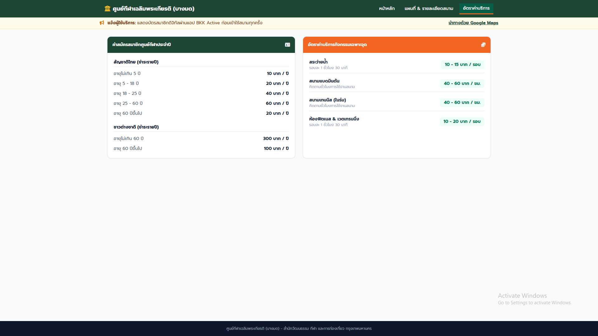

# Design Thinking: ศูนย์กีฬา (ข้าง มจธ.)
 
---
 
## 1. ขั้นตอน Empathize
 
### 1.1 กระบวนการสัมภาษณ์
1. แนะนำตัวเองและบอกวัตถุประสงค์ในการสัมภาษณ์
2. ขออนุญาตนำข้อมูลไปใช้ รวมถึงการถ่ายภาพและอัดเสียง
3. เริ่มสัมภาษณ์
4. สรุปผล
**ระยะเวลา:** คนละ 15 นาที
 
### 1.2 คำถามสัมภาษณ์
- มาที่นี่เพื่อทำกิจกรรมอะไรเป็นหลัก
- เดินทางมาสนามกีฬาอย่างไร
- มาใช้งานที่นี่บ่อยแค่ไหน (กี่ครั้งต่อสัปดาห์)
- มาใช้งานช่วงเวลาใดเป็นหลัก
---
 
## 2. สรุปภาพรวมผลการสัมภาษณ์
 
| ผู้ให้สัมภาษณ์ | เหตุผลหลักที่มาใช้บริการ | Pain Point |
|---|---|---|
| คุณลุงนักวิ่ง | ใกล้บ้าน สะดวกกว่าไปสวนธนฯ ทางวิ่งกว้างกว่า | ไม่มีที่จอดรถ |
| อาจารย์ที่เกษียณ | ใกล้บ้าน พื้นที่กว้าง โปร่งสบายกว่าสวนธนฯ | หาที่จอดรถยากช่วงมีงานแข่ง |
| คุณแม่ | พาลูกเรียนว่ายน้ำ สระมาตรฐานโอลิมปิก ใกล้บ้าน | ที่จอดรถหายากและไม่พอ |
| เด็กที่วินชาร์จ | มาเตะฟุตบอลเป็นหลัก | ไม่มีโดมคลุมสนามฟุตบอล เล่นไม่ได้เมื่อแดดจัด/ฝนตก |
| เด็กโรงเรียนคิม | เพิ่งเริ่มมาใช้บริการ (3 วัน) | ไม่รู้ว่าจุดใดจอดรถได้/ไม่ได้ + ที่จอดรถน้อย |
 
### 2.1 รายละเอียดรายบุคคล
 
**คุณลุงนักวิ่ง**
เล่าว่าสนามกีฬาไม่มีอะไรไม่ดี ทุกอย่างโอเคตั้งแต่เปลี่ยนผู้ดูแลสนามใหม่ จากเดิมที่จัดตลาดนัดบ่อย ๆ เปลี่ยนมาเน้นจัดการแข่งขันกีฬาแทน ทำให้ไม่มีพ่อค้าแม่ค้ามาขายของเกะกะพื้นที่ ชอบมาที่นี่เพราะใกล้บ้านกว่าสวนธนฯ ซึ่งทางวิ่งแคบและไม่มีที่จอดรถ ส่วนที่สนามกีฬาแม้จะมีที่จอดแต่ก็มีจำนวนน้อยและมีรถสวนไปมา โดยรวมมองว่าตอนนี้ลงตัวดี
 
**อาจารย์ที่เกษียณ**
มาที่สนามกีฬาเพราะใกล้บ้าน ต่างจากสวนธนฯ ที่ต้องเดินเพิ่มอีกราว 400 เมตร และมองว่าสนามกีฬากว้างกว่า ขณะที่สวนธนฯ มีต้นไม้เยอะเกินไป โดยรวมพอใจ แต่หาที่จอดรถยากในช่วงที่มีงานแข่งขัน
 
**คุณแม่**
ปัญหาหลักที่เจอคือหาที่จอดรถยากและมีไม่เพียงพอ ส่วนอื่นลงตัวดีหมด เหตุผลที่มาคือพาลูกมาเรียนว่ายน้ำ เลือกที่นี่เพราะใกล้บ้านและสระเป็นมาตรฐานโอลิมปิก ให้ลูกเรียนเพื่อเสริมความแข็งแรงและฝึกสมาธิให้จดจ่อกับสิ่งตรงหน้าได้
 
**เด็กที่วินชาร์จ**
มาเตะฟุตบอลเป็นหลัก สิ่งที่อยากให้มีคือโดมคลุมสนามฟุตบอลขนาดทีมละ 7 คน เพราะช่วงกลางวันแดดร้อนจนเล่นไม่ได้ และเวลาฝนตกก็เปียก ส่วนเรื่องอื่นไม่ได้ให้ความสำคัญมากนักและมองว่าโอเคดี
 
**เด็กโรงเรียนคิม**
เพิ่งมาใช้บริการได้ 3 วัน ไม่มีปัญหาอะไรมาก ยกเว้นช่วงแรก ๆ ที่หาที่จอดรถยาก ไม่รู้ว่าจุดไหนจอดได้หรือจอดไม่ได้ (วันที่มาสัมภาษณ์คือวันอาทิตย์)
 
---
 
## 3. Empathy Map
 
### 3.1 What / How / Why
 
| หัวข้อ | รายละเอียด |
|---|---|
| **What** (มาทำอะไร) | มาเพื่อออกกำลังกาย |
| **How** (มาอย่างไร) | เดินทางด้วยรถหรือเดินมาในช่วงเย็น ๆ หรือตอนว่าง |
| **Why** (ทำไมถึงมา) | อยากเสริมสร้างทักษะกีฬาและร่างกาย พร้อมผ่อนคลายความเครียดจากชีวิตประจำวัน |
 
### 3.2 Say / Do / Think / Feel
 
| หัวข้อ | รายละเอียด |
|---|---|
| **Say** | ที่จอดรถน้อยมาก |
| **Do** | มาวิ่ง ออกกำลังกาย และพบปะเพื่อน ๆ |
| **Think** | อยากเสริมสร้างทักษะกีฬาและสุขภาพที่ดี รวมถึงอยากได้สังคมใหม่ ๆ |
| **Feel** | รู้สึกโอเคและสบายใจ |
 
---
 
## 4. Reframe: We Met / We Surprised / We Wonder
 
**We met:**
จากการเข้าไปสัมภาษณ์แต่ละคนในสถานที่ ซึ่งมีช่วงอายุหลากหลาย พบว่าแต่ละคนมีวัตถุประสงค์ในการมาที่แตกต่างกันไป เช่น บางคนมาเพื่อฝึกกีฬา บางคนมาเพื่อผ่อนคลาย ทำให้สถานที่แห่งนี้เป็นแหล่งรวมผู้คนหลากหลายช่วงวัย
 
**We surprised to notice:**
จากการสัมภาษณ์ที่ผ่านมา เราตกใจกับปัญหาที่พบ เพราะทุกคนตอบตรงกันว่าปัญหาหลักคือเรื่องที่จอดรถไม่เพียงพอต่อความต้องการ
 
**We wonder if this means:**
ความพึงพอใจของผู้ใช้ส่วนใหญ่มีแนวโน้มไปในทางที่ดี ทั้งด้านสภาพแวดล้อม สิ่งอำนวยความสะดวก และความสะอาด แต่มีจุดเดียวที่ผู้ใช้งานแทบทุกคนไม่พึงพอใจตรงกัน คือที่จอดรถมีน้อยเกินไป
 
**It would be game changing to:**
- มีระบบแจ้งจำนวน/ตำแหน่งที่จอดรถว่างแบบ Real-time ผ่านเว็บหรือแอป ก่อนผู้ใช้เดินทางมาถึงศูนย์ฯ
- มี Interactive Map ที่ระบุตำแหน่งปัจจุบันของผู้ใช้ได้ทันที (You are here) พร้อมนำทางไปยังจุดต่างๆ ภายในศูนย์ฯ แบบ turn-by-turn
- มีระบบแจ้งเตือนอัตโนมัติเมื่อมีบริการใหม่ กิจกรรมพิเศษ หรือการเปลี่ยนแปลงตารางเวลา ส่งตรงถึงผู้ใช้ผ่านแอป BKK Active
- มีจุดบริการครบวงจร (One-stop service point) ที่รวมข้อมูลห้องพยาบาล ห้องน้ำ จุดพักคอย และร้านค้า/น้ำดื่ม ไว้ในที่เดียวทั้งบนเว็บและป้ายบอกทางจริงในพื้นที่
 
---
 
## 5. User Persona
 
### Persona 1: คุณต้น — ผู้ใช้สนามกีฬาในพื้นที่
 
| | |
|---|---|
| **ชื่อ** | คุณต้น (นามสมมติ) |
| **อายุ** | 35 ปี |
| **อาชีพ** | พนักงานบริษัท |
| **ลักษณะการใช้งาน** | มาออกกำลังกายหรือทำกิจกรรมกับครอบครัว |
 
**Background**
คุณต้นอาศัยอยู่ใกล้สนามกีฬา จึงเลือกใช้ที่นี่เพราะเดินทางสะดวกและมีสิ่งอำนวยความสะดวกที่ตอบโจทย์กิจกรรมต่าง ๆ เช่น การวิ่ง การออกกำลังกาย การว่ายน้ำ และการเล่นกีฬา โดยมองว่าสนามกีฬาโดยรวมมีสภาพดีและใช้งานได้อย่างเหมาะสม
 
**Goals**
- เดินทางมาสนามกีฬาได้สะดวก
- เริ่มกิจกรรมได้โดยไม่เสียเวลาหาที่จอดรถ
- ทราบข้อมูลพื้นที่จอดรถอย่างชัดเจน
- ใช้สนามกีฬาได้อย่างสะดวกและต่อเนื่อง
**Needs**
- ที่จอดรถที่เพียงพอ
- ตำแหน่งพื้นที่จอดรถที่ชัดเจน
- ข้อมูลว่าบริเวณใดจอดรถได้
- ข้อมูลที่ช่วยวางแผนก่อนเดินทางมาสนามกีฬา
**Pain Points**
- ที่จอดรถมีจำนวนจำกัด
- หาที่จอดรถยากเมื่อมีการแข่งขันหรือกิจกรรม
- ผู้ใช้ใหม่อาจไม่ทราบว่าบริเวณใดจอดได้
- เสียเวลาวนหาที่จอดรถ
**Motivation**
ต้องการใช้สนามกีฬาใกล้บ้านที่มีสิ่งอำนวยความสะดวกเหมาะสม โดยไม่ต้องเจอความยุ่งยากก่อนเริ่มกิจกรรม
 
**Quote**
> “สนามกีฬาดีอยู่แล้ว แต่อยากให้หาที่จอดรถได้ง่ายกว่านี้”
 
**Insight**
ผู้ใช้ไม่ได้ต้องการเปลี่ยนแปลงสนามกีฬาทั้งหมด เพราะโดยรวมตอบโจทย์การใช้งานได้ดีอยู่แล้ว แต่ต้องการลดความไม่สะดวกในขั้นตอนการเข้ามาใช้บริการ โดยเฉพาะการค้นหาและทำความเข้าใจพื้นที่จอดรถ
 
**POV (Point of View)**
ผู้ใช้สนามกีฬาที่เดินทางมาเพื่อออกกำลังกายหรือทำกิจกรรม ต้องการข้อมูลเกี่ยวกับพื้นที่จอดรถที่ชัดเจนและเข้าถึงง่าย เพราะแม้สนามกีฬาโดยรวมจะตอบโจทย์การใช้งาน แต่การหาที่จอดรถยากและไม่ทราบว่าบริเวณใดจอดได้ ทำให้ผู้ใช้เสียเวลาและรู้สึกไม่สะดวกก่อนเริ่มกิจกรรม
 
---
 
## 6. User Journey Map: ศูนย์กีฬา (ข้าง มจธ.)
**รูปแบบการวิเคราะห์:** Persona-Based Journey Mapping (First – Next – Then)
 
### Persona 1: ลุงนักวิ่ง
*ประเด็นหลัก: ความสะดวกในการซ้อมวิ่ง และความพึงพอใจต่อการเปลี่ยนแปลงของสนาม*
 
| ขั้นตอน | รายละเอียด |
|---|---|
| **1. First** | **ความรู้สึก:** พึงพอใจและสบายใจในการเลือกสถานที่ • **การกระทำ:** เดินทางมาซ้อมวิ่งเป็นประจำเพราะอยู่ใกล้บ้าน สะดวกกว่าเดินทางไปสวนธนบุรีรมย์ที่ไกลและทางวิ่งแคบ |
| **2. Next** | **จุดดรอป:** หงุดหงิดเล็กน้อยกับที่จอดรถที่มีน้อยและรถสวนไปมา • **จุดพีค:** ประทับใจสภาพแวดล้อมปัจจุบันมาก หลังเปลี่ยนผู้ดูแลสนามใหม่ที่ยกเลิกตลาดนัดแล้วเน้นจัดแข่งขันกีฬาแทน ทำให้ไม่มีร้านค้ามาเกะกะพื้นที่วิ่ง |
| **3. Then** | มองว่าศูนย์กีฬาปัจจุบันลงตัวมาก ไม่มีอะไรที่ไม่ดี และจะยังคงเลือกมาออกกำลังกายที่นี่ต่อไปเป็นหลัก |
 
### Persona 2: อาจารย์เกษียณ
*ประเด็นหลัก: สภาพแวดล้อมที่โปร่งสบาย และปัญหาการจราจรช่วงมีงานแข่ง*
 
| ขั้นตอน | รายละเอียด |
|---|---|
| **1. First** | **ความรู้สึก:** ผ่อนคลาย เดินทางมาออกกำลังกายตามกิจวัตร • **การกระทำ:** เลือกมาที่นี่เพราะใกล้บ้าน ไม่ต้องเดินไกลเหมือนไปสวนธนบุรีรมย์ (เพิ่มอีก 400 เมตร) และชอบพื้นที่กว้างขวาง โล่งสบาย ไม่ทึบหรือมีต้นไม้เยอะเกินไป |
| **2. Next** | **จุดดรอป (Core Pain Point):** อารมณ์เสียและลำบากเรื่องหาที่จอดรถยากมาก โดยเฉพาะวันที่มีงานแข่งขัน • **จุดพีค:** สบายใจและผ่อนคลายเมื่อได้ออกกำลังกายในพื้นที่กว้างและบรรยากาศโปร่งสบาย |
| **3. Then** | มองว่าเป็นสถานที่ที่ดีมากและตอบโจทย์การพักผ่อน แต่เสนอให้จัดระบบที่จอดรถให้ดีกว่านี้ในช่วงมีงานแข่ง |
 
### Persona 3: คุณแม่
*ประเด็นหลัก: การพาลูกมาเรียนว่ายน้ำเพื่อพัฒนาการ และปัญหาที่จอดรถไม่เพียงพอ*
 
| ขั้นตอน | รายละเอียด |
|---|---|
| **1. First** | **ความรู้สึก:** มุ่งมั่นและตั้งใจดีในการส่งเสริมพัฒนาการของลูก • **การกระทำ:** พาลูกมาเรียนว่ายน้ำที่สระมาตรฐานโอลิมปิก เพราะใกล้บ้าน โดยหวังให้ลูกแข็งแรงและฝึกสมาธิ |
| **2. Next** | **จุดดรอป (Core Pain Point):** เครียดและหงุดหงิดกับปัญหาที่จอดรถหายากและไม่เพียงพอ • **จุดพีค:** ชื่นชมคุณภาพสิ่งอำนวยความสะดวก โดยเฉพาะสระว่ายน้ำมาตรฐานโอลิมปิกที่ช่วยให้ลูกเรียนและฝึกสมาธิได้เต็มที่ |
| **3. Then** | มองว่าโดยรวมทุกอย่างลงตัวและตอบโจทย์ครอบครัว ยกเว้นเรื่องที่จอดรถที่อยากให้เพิ่มจำนวนช่องจอด |
 
### Persona 4: เด็กที่วินชาร์จ
*ประเด็นหลัก: สภาพสนามฟุตบอล และข้อจำกัดเรื่องสภาพอากาศ (แดด/ฝน)*
 
| ขั้นตอน | รายละเอียด |
|---|---|
| **1. First** | **ความรู้สึก:** ตื่นเต้น สนุกสนาน มุ่งมั่นจะมาเตะฟุตบอลกับเพื่อน • **การกระทำ:** เดินทางมาเพื่อเล่นฟุตบอลเป็นหลัก โดยไม่ได้ให้ความสำคัญกับสิ่งอำนวยความสะดวกส่วนอื่นมากนัก |
| **2. Next** | **จุดดรอป:** เล่นฟุตบอลลำบากและเหนื่อยสะสม เพราะช่วงกลางวันแดดร้อนจัดจนเตะไม่ได้ และฝนตกก็เปียกปอนเพราะสนามไม่มีหลังคา • **จุดพีค:** สนุกสนานกับการได้เตะฟุตบอลและทำกิจกรรมร่วมกับเพื่อน ๆ |
| **3. Then** | มองว่าภาพรวมของศูนย์กีฬาโอเคแล้ว แต่มีข้อเสนอแนะหลักคือ **อยากให้ทำโดมหลังคาครอบสนามฟุตบอลขนาดทีมละ 7 คน** เพื่อให้เล่นได้ทุกสภาพอากาศ |
 
### Persona 5: เด็กโรงเรียนคิม
*ประเด็นหลัก: ผู้ใช้บริการรายใหม่ และความสับสนเรื่องสัญลักษณ์จุดจอดรถ*
 
| ขั้นตอน | รายละเอียด |
|---|---|
| **1. First** | **ความรู้สึก:** แปลกใหม่และยังไม่คุ้นชินกับสถานที่ (พึ่งมาใช้บริการได้ 3 วัน วันที่สัมภาษณ์คือวันอาทิตย์) |
| **2. Next** | *(เอกสารต้นฉบับยังไม่ได้ระบุรายละเอียดจุดพีค/จุดดรอปของ Persona นี้)* |
| **3. Then** | *(เอกสารต้นฉบับยังไม่ได้ระบุ)* |

---

## 7. Ideate Artifacts 

### Brainstorming

- ทําป้ายแผนที่คร่าวๆเฉพาะที่จอดรถ : ทําป้ายบอดใหญ่รายละเอียดสถานที่จอดรถที่สามรถจอดได้ในศูนย์กีฬา
- Qr code แผนที่ : ทําโปสเตอร์แผนที่ขึ้นมาแล้วนําไปทําเป็น Qr code เพื่อไปแปะตามจุดต่างๆในศูนย์กีฬา
- Appication Map : ทํา Appication ที่สามรถดูที่จอดรถได้
- Website Map : ทํา Website ที่สามรถดูรายละเอียดสถานที่และที่จอดรถได้
- ทํา Web แผนที่แสกนอ่าน Qr code ได้ง่าย : ทํา Web แผนที่ที่มีรายละเอียดเรื่องสถานที่และที่จอดรถภายในศูนย์กีฬา
- แนวคิดช่วยบอกทาง : ทําหุ่นยนต์ที่ฝช้แนวคิดจ่างๆในการช่วยบอกทาง
- ตู้หยอดเหรียญสอบถามเส้นทาง : พัฒณาตู้หยอดเหรียญให้สามารถช่วยบอกทางได้

### Rational **(ทำได้จริง สมเหตุสมผล)**

- ทําป้ายแผนที่คร่าวๆเฉพาะที่จอดรถ
- Qr code แผนที่

### Darling **(ที่ชื่นชอบมาก)**

- ทํา Web แผนที่แสกนอ่าน Qr code ได้ง่าย

### Delight **(ที่ชื่นชอบ)**

- Appication Map
- Website Map

### Long Shot **(แก้ไขในระยะยาว)**

- แนวคิดช่วยบอกทาง
- ตู้หยอดเหรียญสอบถามเส้นทาง

---

### Final Idea
- **ทํา Web แผนที่แสกนอ่าน Qr code ได้ง่าย**

---

## 8. Phototype
เพื่อทดสอบแนวคิดที่ได้จากขั้นตอน Ideate ทีมงานได้พัฒนาเว็บไซต์ต้นแบบ (Prototype) สำหรับ ศูนย์กีฬาเฉลิมพระเกียรติ (บางมด) 

🔗 ลิงก์ทดลองใช้งาน: **https://nammonwaeo-collab.github.io/bangmod-/**

### รายละเอียดหน้าเว็บไซต์

#### เว็บไซต์ประกอบด้วย 3 ส่วนหลัก ได้แก่

|   หน้า  |  รายละเอียด / ทำอะไรได้บ้าง |
|---|---|
|**1. หน้าหลัก**|	แสดงข้อมูลแนะนำศูนย์กีฬาฯ ภาพรวมบริการ พร้อมตัวเลขสรุปสำคัญ ได้แก่ จำนวนประเภทกีฬา 19 ชนิด, โซนบริการหลัก 9 โซน, อัตราค่าสมาชิกรายปี 10–60 บาท (สำหรับคนไทย) และเวลาเปิดให้บริการ 05:00–21:00 น. ทุกวัน นอกจากนี้ยังมีข้อความแจ้งเตือนผู้ใช้บริการให้แสดงบัตรสมาชิกดิจิทัลผ่านแอป BKK Active ก่อนเข้าใช้สนามทุกครั้ง
|**2. แผนที่ & รายละเอียดสนาม** |	แสดงแผนที่โซนกีฬาและพิกัดสนามภายในศูนย์ฯ ช่วยให้ผู้ใช้เช็กตำแหน่งอาคารยิมเนเซียม สระว่ายน้ำ สนามเทนนิสในร่ม และระเบียบการเข้าใช้งานแต่ละจุดได้ล่วงหน้า ลดความสับสนเรื่องสถานที่สำหรับผู้ใช้บริการรายใหม่
|**3. อัตราค่าบริการ**|	แสดงรายละเอียดค่าธรรมเนียมและค่าบริการทั้งหมด ทั้งค่าสมัครสมาชิกรายปีแบ่งตามช่วงอายุ และอัตราค่าเช่าสนาม/สระว่ายน้ำ ช่วยให้ผู้ใช้วางแผนงบประมาณและตัดสินใจเข้าใช้บริการได้ง่ายขึ้น

---

### Example

#### หน้าหลัก

#### แผนที่ & รายละเอียดสนาม

#### อัตราค่าบริการ

---

## 9. FeedBack

จากการไปสัมภาษณ์กลุ่มคนในศูนย์กีฬาให้ทดลองใช้ตัว Phototype ที่เราสร้างขึ้น ผลการสัมภาษณ์มีหลากหลายอย่างแต่ส่วนมากจะออกไปแนวทางอยากให้พัฒนาเพิ่มไม่ได้บอกแค่สถานที่กับที่จอดรถ

### ผลการสัมภาษณ์

- ขาดจุดบอกห้องพยาบาล
- ตำแหน่งห้องน้ำที่ใช้ได้
- ไม่ได้ระบุตำแหน่ง user
- ยิมเปิดใหม่โดยที่เพิ่งรู้
- แจ้งเรื่องในสนามไม่มีน้ำหรือของกินขาย

---

### วิเคราะห์ Feedback

| Feedback ที่ได้ | หมวดหมู่ | Insight เชิงลึก |
|---|---|---|
| ขาดจุดบอกห้องพยาบาล | ข้อมูลด้านความปลอดภัย (Safety) | ผู้ใช้กังวลเรื่องเหตุฉุกเฉิน/บาดเจ็บระหว่างเล่นกีฬา ต้องการรู้ล่วงหน้าว่าจะขอความช่วยเหลือที่ไหน |
| ตำแหน่งห้องน้ำที่ใช้ได้ | สิ่งอำนวยความสะดวก (Facility) | แผนที่ยังไม่ครอบคลุมสิ่งอำนวยความสะดวกพื้นฐานที่ผู้ใช้ต้องใช้บ่อยที่สุด |
| ไม่ได้ระบุตำแหน่ง user | การนำทาง (Navigation/Usability) | แผนที่ยังเป็น static ผู้ใช้อ่านแผนที่ไม่ออกว่าตัวเองอยู่จุดไหน ทำให้สับสนซ้ำ |
| ยิมเปิดใหม่โดยที่เพิ่งรู้ | ความทันสมัยของข้อมูล (Content Freshness) | ข้อมูลบนเว็บไม่อัปเดตตามสถานะจริงของศูนย์ฯ ผู้ใช้พลาดโอกาสใช้บริการใหม่ |
| ไม่มีน้ำ/ของกินขายในสนาม | การตั้งความคาดหวัง (Expectation Setting) | เว็บไม่ได้แจ้งข้อจำกัดนี้ล่วงหน้า ทำให้ผู้ใช้วางแผนผิดพลาด |

### สาเหตุหลัก (Root Cause)

**1. แผนที่ยังไม่ "ใช้งานได้จริง" ในสถานการณ์หน้างาน**
ขาดจุดพยาบาล ห้องน้ำ และตำแหน่งผู้ใช้ เพราะตอนออกแบบเน้นโซนกีฬาหลักเป็นหลัก ไม่ได้มองจากมุมผู้ใช้ที่ต้องการรู้จุด support facilities

**2. เว็บไซต์เป็น static content ไม่สะท้อนสถานะปัจจุบันของศูนย์ฯ**
ยังไม่มีกลไกอัปเดตข้อมูลหรือประกาศ (announcement) และไม่ได้ตั้งความคาดหวังผู้ใช้เรื่องข้อจำกัดของสถานที่ล่วงหน้า

### ลำดับความสำคัญในการแก้ไข

| Feedback | ผลกระทบ | ความยาก | ระดับความสำคัญ |
|---|---|---|---|
| ไม่มีน้ำ/ของกินขาย | สูง | ต่ำ | 🔴 ทำก่อน |
| ยิมเปิดใหม่แต่ไม่รู้ | สูง | ต่ำ-กลาง | 🔴 ทำก่อน |
| ขาดจุดห้องพยาบาล | สูง (ความปลอดภัย) | กลาง | 🟠 สำคัญ |
| ตำแหน่งห้องน้ำ | กลาง-สูง | กลาง | 🟠 สำคัญ |
| ไม่ระบุตำแหน่ง user | กลาง | สูง | 🟡 เวอร์ชันถัดไป |

---

## 10. Next Iteration

จาก Feedback ที่ได้รับ ทีมงานได้วางแผนปรับปรุง Prototype ในเวอร์ชันถัดไป โดยจัดลำดับตามความสำคัญและความเร่งด่วนที่ควรทำ ดังนี้

### 10.1 สิ่งที่ควรทำก่อน (Quick Win)

- **เพิ่มข้อความแจ้งเตือนล่วงหน้า** ในหน้าหลักหรือหน้ารายละเอียดสนาม ว่า "ภายในศูนย์ฯ ไม่มีจำหน่ายน้ำดื่ม/อาหาร กรุณาเตรียมมาเอง"
- **เพิ่มระบบประกาศ/แบนเนอร์ข่าวสาร** (Announcement Bar) บนหน้าแรก สำหรับแจ้งบริการใหม่ เช่น ยิมเปิดใหม่ กิจกรรมพิเศษ หรือประกาศสำคัญอื่นๆ

### 10.2 สิ่งที่ควรทำถัดไป (สำคัญ)

- **เพิ่มไอคอนสิ่งอำนวยความสะดวกบนแผนที่ให้ครบ** ได้แก่ ห้องพยาบาล และห้องน้ำ (แยกชาย/หญิง) นอกเหนือจากจุดจอดรถที่มีอยู่แล้ว

### 10.3 แผนพัฒนาระยะยาว

- **พัฒนาแผนที่ให้เป็น Interactive Map** ที่สามารถระบุตำแหน่งปัจจุบันของผู้ใช้ได้ (You are here) เช่น การปักหมุดตำแหน่ง หรือระบบนำทางภายในอาคารในอนาคต

### สรุปเป้าหมายของเวอร์ชันถัดไป

การปรับปรุงทั้งหมดมุ่งแก้ปัญหาหลัก 2 ข้อที่พบจากการทดสอบ คือ (1) ทำให้แผนที่ *ใช้งานได้จริง* ครอบคลุมสิ่งอำนวยความสะดวกที่จำเป็น และ (2) ทำให้เว็บไซต์ *สะท้อนสถานะปัจจุบัน* ของศูนย์กีฬาฯ ได้ทันเวลา เพื่อลดความสับสนและเพิ่มความมั่นใจให้ผู้ใช้บริการรายใหม่

---

## 11. Team members' work

### Team Member 
- น้ำมนต์ แววดี
- ณภัทร ศักประดับกุล
- เนติพงษ์ อินทนนท์
- ศุภชัย รุ่งแสง
- วชิรวิทย์ เสน่หา
- วุฒิภัทร สุวรานนท์

### Tasks

1. Ideate
   ผู้รับผิดชอบ: ทุกคน (ณภัทร, วชิรวิทย์, วุฒิภัทร, ศุภชัย, น้ำมนต์, เนติพงษ์)

2. Prototype
   - หน้าเว็บ: วุฒิภัทร, ศุภชัย ,ณภัทร
   - หน้าแผนที่: น้ำมนต์
   - หน้าอัตราค่าบริการ: (ยังไม่ระบุ)

3. สัมภาษณ์ และ Feedback
   ผู้รับผิดชอบ: วุฒิภัทร, วชิรวิทย์ , เนติพงษ์

4. จัดการเนื้อหาใส่ GitHub
   ผู้รับผิดชอบ: ณภัทร

5. พรีเซนต์ รอบ 1 และ 2
   ผู้รับผิดชอบ: ณภัทร, วชิรวิทย์ , เนติพงษ์

สรุปรายบุคคล
- ณภัทร: Ideate, Prototype หน้าเว็บ, จัดการเนื้อหาใส่ GitHub, พรีเซนต์ รอบ 1 และ 2
- วชิรวิทย์: Ideate, สัมภาษณ์ และ Feedback, พรีเซนต์ รอบ 1 และ 2
- วุฒิภัทร: Ideate, Prototype หน้าเว็บ, สัมภาษณ์ และ Feedback
- ศุภชัย: Ideate, Prototype หน้าเว็บ
- น้ำมนต์: Ideate, Prototype หน้าแผนที่ 
- เนติพงษ์: Ideate, สัมภาษณ์ และ Feedback, พรีเซนต์ รอบ 1 และ 2