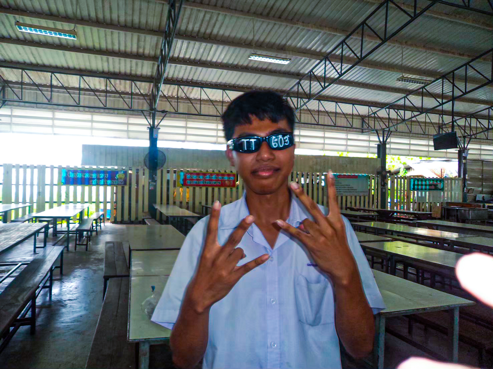

# ช่วยเล่าให้ฟังหน่อยได้มั้ยว่าชีวิตหลังจากที่เข้ามหาลัยมาตั้งแต่แรกจนถึงปัจจุบันเป็นไงบ้าง "เนติพงษ์,เน"

> การต้องเข้ามหาวิทยาลัยคนเดียวโดยไม่มีเพื่อนเลย ทำให้เกิดความเหงาและประหม่าเพราะทุกอย่างดูใหม่ไปหมด แต่จุดเปลี่ยนสำคัญคือค่าย **IT Starter Pack** ที่ได้เจอ **"อันดา"** เพื่อนคนแรกที่เข้ามาชวนคุย ทำให้ลดความกังวลไปได้เยอะ กว่าตอนแรกที่ไม่มีเพื่อนเลย จนตอนนี้กลายเป็นกลุ่มเพื่อนถึง **17 คน**
> 
> ในส่วนของการเรียน การเรียนเป็นภาษาอังกฤษที่ไม่ถนัดเคยสร้างความกังวลในช่วงแรก แต่ด้วยความอดทนของเน ก็ค่อยๆ เรียนรู้และปรับตัวจนจับทางได้ เรียนเข้าใจมากขึ้น สะท้อนให้เห็นว่าเนเป็นคนที่ไม่ยอมแพ้ง่ายๆ และพร้อมที่จะเรียนรู้สิ่งใหม่ๆ อยู่เสมอ

---

##  สาเหตุที่เลือกมาเรียนที่นี่
 ยื่นพอร์ตติดและยังอยู่ใกล้บ้าน เดินทางสะดวก และยังอุ่นใจเพราะเพื่อนเรียนอยู่ที่มหาวิทยาลัยเดียวกันแต่ะคนละสาขา ช่วยให้ปรับตัวได้ง่ายขึ้น

---

##  งานอดิเรก
 เล่นเกมฟังเพลง และเรียนรู้เรื่องทั่วไป ชอบศึกษาเรื่องที่ตัวเองสนใจหรืออยากทำความเข้าใจเพิ่มในช่วงนั้นๆ

---

##  อาหารที่ชอบ
1. **ข้าวมันไก่**
2. **ก๋วยเตี๋ยว**

เป็นอาหารที่เนกินประจำอยู่แล้ว

---

### รูปภาพประจำตัว

*รูปภาพของเน*

ช่องทางการติดต่อได้ที่: [INSTAGRAM](https://www.instagram.com/netipong._/)