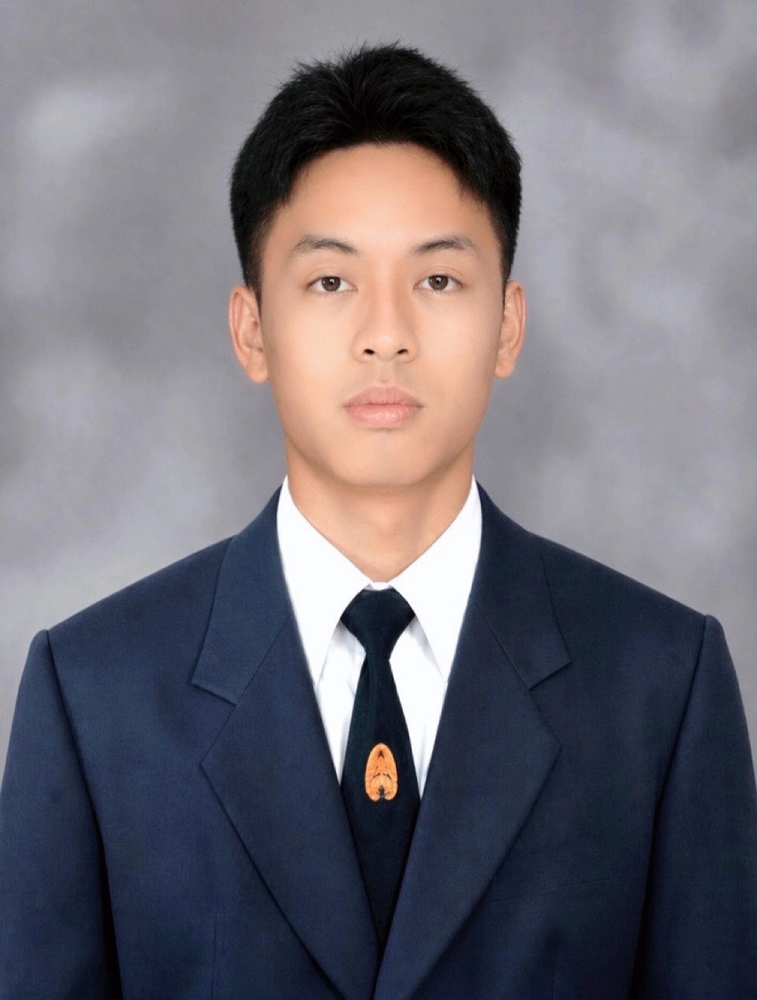

  
**ผู้สัมภาษณ์ :** # Wachiravit Sneaha (050) 🐱
**ผู้ให้สัมภาษณ์ :** Payuth charoensri (035) 🐻

---

## 1. ช่วยเล่าให้ฟังหน่อยได้มั้ยว่าชีวิตหลังจากที่เข้ามหาลัยมาตั้งแต่แรกจนถึงปัจจุบันเป็นไงบ้าง 😎👂

 **ตอนที่เริ่มเข้ามาเรียนใหม่ ๆ เพื่อนยังไม่ค่อยรู้จักคนอื่นมากนัก ส่วนใหญ่จึงใช้เวลาร่วมกับกลุ่มคนที่เคยรู้จักกันอยู่แล้ว ทำให้ยังรู้สึกไม่ค่อยคุ้นเคยกับสังคมใหม่เท่าไหร่ จนได้มีโอกาสเข้าร่วม SIT ORIGIN และ SIT STARTERPACK ซึ่งเป็นกิจกรรมที่ทำให้ได้พบปะผู้คนมากขึ้น และได้ทำความรู้จักกับเพื่อนทั้งในสาขาของตัวเองและจากสาขาอื่น ๆ ประสบการณ์จากกิจกรรมเหล่านี้ช่วยให้เพื่อนค่อย ๆ เปิดใจและกล้าเข้าสังคมมากกว่าเดิม จากที่เมื่อก่อนมักจะเกร็งและไม่กล้าเป็นฝ่ายเริ่มพูดคุยก่อน ปัจจุบันสามารถเข้าหาคนอื่นและปรับตัวกับสภาพแวดล้อมใหม่ได้ง่ายขึ้น ## 🤩**

 

## 2.เพราะอะไรถึงเลือกเรียนที่นี่ 🎓

 **ยื่นพอร์ตติดและยังอยู่ใกล้บ้าน และยังอุ่นใจเพราะเพื่อนเรียนอยู่ที่มหาวิทยาลัยเดียวกันแต่ะคนละสาขา ช่วยให้ปรับตัวได้ง่ายขึ้น** 

 

## 3.งานอดิเรกที่ชอบทําอะไรในตอนว่าง 🤖👽👾

 **งานอดิเรกที่เพื่อนชอบทําส่วนมากคือ การเล่นเวท,บอลและอ่านหนังสือ**

 

## 4.ชอบกินอะไร 😋🍜🍔

 **เพื่อนชอบกินอกไก่ และอาหารจานหลักส่วนมากชอบกินพิซซ่า 🍕🍕**

Contact: [Facebook](https://www.facebook.com/payut.charoensri.1)

---