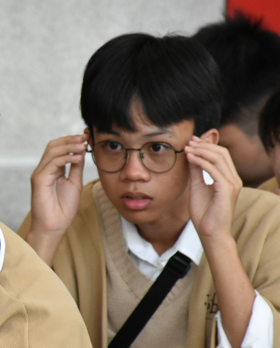

##  คนสัมภาษณ์:  วชิรวิทย์ เสน่หา
##  คนโดนสัมภาษณ์: วุฒิภัทร สุวรานนท์

###  ช่วยเล่าให้ฟังหน่อยได้มั้ยว่าชีวิตหลังจากที่เข้ามหาลัยมาตั้งแต่แรกจนถึงปัจจุบันเป็นไงบ้าง 
- ก็ช่วงแรกๆ ตอนมาปฐมนิเทศก็รู้สึกประหม่าอยู่บ้าง เพราะยังไม่ค่อยรู้จักใคร แต่พอได้มาเจอเพื่อนๆ ใน IT Starter Pack แล้วก็ได้รู้จักเพื่อนใหม่ๆ ก็รู้สึกดีขึ้น แล้วพอได้เรียนพื้นฐานต่างๆ ก็รู้สึกว่าตัวเองน่าจะเรียนได้ แล้วก็มีความมั่นใจมากขึ้น ตอนนี้ก็มีงานให้ทำอยู่เรื่อยๆ มีเรื่องให้คิดบ้าง แต่โดยรวมก็ไม่ได้เครียดหรือเหนื่อยมาก ทุกอย่างก็เริ่มลงตัวดี
### เหตุผลที่เลือกเรียนที่นี่
-  ชอบบรรยากาศการเรียนการสอน
-  ติดรอบแรก

###  งานอดิเรก
-  นอน
-  ฟังเพลง
-  เล่นเกม

###  เมนูโปรด
- ผัดพริกแกงหมูกรอบใส่ไข่ลวก
- ก๋วยเตี๋ยวเป็ด
- ข้าวผัด

ตามไปส่องได้ที่: [INSTAGRAM](https://www.instagram.com/wb.nomsod/)