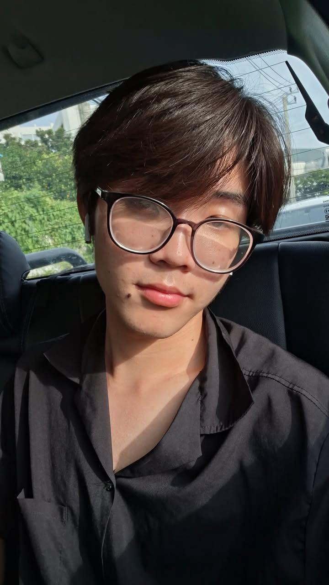

# Interview 017 

## ช่วยเล่าชีวิตมหาลัยตั้งแต่วันแรกจนถึงปัจจุบันให้ฟังหน่อย?
**เพื่อนเล่าว่าช่วงแรกตั้งแต่มาค่าย starter pack ต้องมีการปรับตัวเยอะ แล้วด้วยความที่ยังไม่รู้จักใครเลยก็เลยกังวลและประหม่าเล็กน้อย ช่วงแรกที่มาต้องปรับตัวเยอะแต่พอได้เข้าค่ายที่มีรุ่นพี่ช่วยแนะนำเลยใช้ชีวิตตอนเรียนได้สบายมากขึ้น และก็ผ่อนคลายมากขึ้นเพราะได้เจอได้รู้จักเพื่อนใหม่**

## เพราะอะไรถึงเลือกที่นี่?
**อยู่ใกล้บ้าน และมีเพื่อนมาเรียนที่นี่เยอะ ด้วยความที่นี่ขึ้นชื่อเรื่องงานวิจัยและเพื่อนอยากทำวิจัยอยู่แล้วเลยเลือกเข้าที่นี่**

## กิจกรรมยามว่างที่เพื่อนชอบ?
**เพื่อนชอบเล่นเกม ทำอาหาร หางานแข่ง เพื่อนดูเป็นคนที่มีความเป็นเอกลักษณ์เป็นคนชิลๆที่มีความเนียบและใฝ่รู้ในตัว**

## เพื่อนชอบกินอะไร?
**ของกินที่เพื่อนชอบก็เป็นข้าวพัด กับเบอร์เกอร์ที่มีไข่ข้น**
