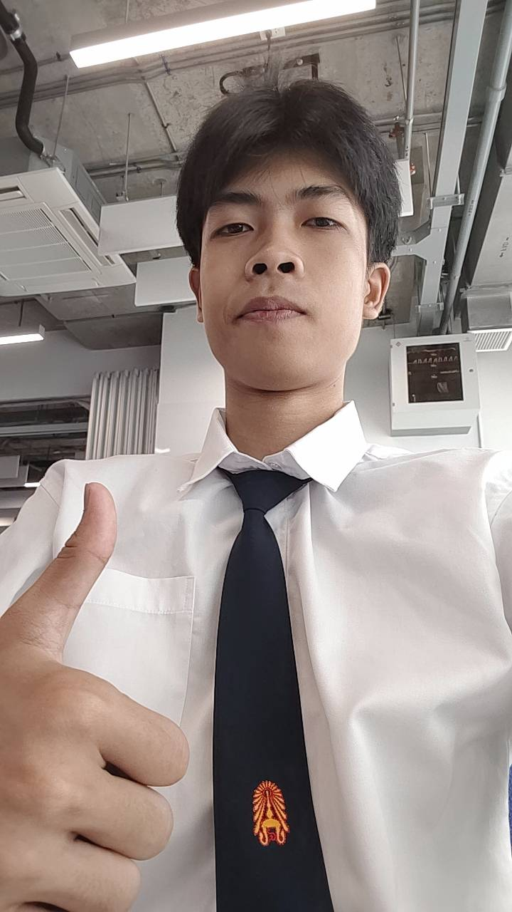

**Interviewer : Napat Salpradupkul**

**Interviewee : Nammon Waeodee** 

 *Question 1 : เพื่่อนบอกว่าช่วงแรกๆที่เข้ามาเพื่่อนส่วนมากที่คุยมีแต่คนที่รู้จักกันมาก่อนแล้ว พอได้เข้าร่วม SIT ORIGIN และ SIT STARTERPACK ก็ได้รู้จักเพื่อนหลายคนๆทั้งไหนสาขาเดี่ยวกันและคนละสาขา ด้วยความที่่เพื่่อนเป็นคนขี้อายก็จะไม่ค่อยกล้าคุยกับใครแต่หลังจากได้เข้าค่ายทั้ง 2 อย่างก็ทําให้เพื่่อนปรับตัวได้มากขึ้น*

 *Question 2 : 
 ตอนแรกเพื่่อนติดมหาลัยอีกที่นึงแต่ทางครอบครัวไม่อยากให้เข้าเพราะว่ามันไกลเกินไปทางครอบครัวเลยอยากให้เข้าที่นี้มากกว่าร่วมถึงเพื่อนเองก็เห็นด้วยเนื่่องจากมหาลัยที่นี้เด่นเรื่องการวิจัยและเทคโนโลยีมากเพื่่อนเลยไว้วางใจที่จะมาเรียนที่นี้*

 *Question 3 :
 งานอดิเรกที่เพื่อนชอบทําส่วนมากคือ การเล่นบาส,บอลและเล่นกีต้าร์*

 *Question 4 : 
 เพื่อนชอบกินเลย์รสสาหร่าย และอาหารจานหลักส่วนมากชอบกินกระเพราหมูกรอบไข่ดาวมากๆ*

ติดตามเพื่่อนได้ที่: [INSTAGRAM](https://www.instagram.com/k1mnm__/)

---

# ช่วยเล่าให้ฟังหน่อยได้มั้ยว่าชีวิตหลังจากที่เข้ามหาลัยมาตั้งแต่แรกจนถึงปัจจุบันเป็นไงบ้าง "เนติพงษ์,เน"

> การต้องเข้ามหาวิทยาลัยคนเดียวโดยไม่มีเพื่อนเลย ทำให้เกิดความเหงาและประหม่าเพราะทุกอย่างดูใหม่ไปหมด แต่จุดเปลี่ยนสำคัญคือค่าย **IT Starter Pack** ที่ได้เจอ **"อันดา"** เพื่อนคนแรกที่เข้ามาชวนคุย ทำให้ลดความกังวลไปได้เยอะ กว่าตอนแรกที่ไม่มีเพื่อนเลย จนตอนนี้กลายเป็นกลุ่มเพื่อนถึง **17 คน**
> 
> ในส่วนของการเรียน การเรียนเป็นภาษาอังกฤษที่ไม่ถนัดเคยสร้างความกังวลในช่วงแรก แต่ด้วยความอดทนของเน ก็ค่อยๆ เรียนรู้และปรับตัวจนจับทางได้ เรียนเข้าใจมากขึ้น สะท้อนให้เห็นว่าเนเป็นคนที่ไม่ยอมแพ้ง่ายๆ และพร้อมที่จะเรียนรู้สิ่งใหม่ๆ อยู่เสมอ

# ช่วยเล่าให้ฟังหน่อยได้มั้ยว่าชีวิตหลังจากที่เข้ามหาลัยมาตั้งแต่แรกจนถึงปัจจุบันเป็นไงบ้าง "เนติพงษ์,เน"

> การต้องเข้ามหาวิทยาลัยคนเดียวโดยไม่มีเพื่อนเลย ทำให้เกิดความเหงาและประหม่าเพราะทุกอย่างดูใหม่ไปหมด แต่จุดเปลี่ยนสำคัญคือค่าย **IT Starter Pack** ที่ได้เจอ **"อันดา"** เพื่อนคนแรกที่เข้ามาชวนคุย ทำให้ลดความกังวลไปได้เยอะ กว่าตอนแรกที่ไม่มีเพื่อนเลย จนตอนนี้กลายเป็นกลุ่มเพื่อนถึง **17 คน**
> 
> ในส่วนของการเรียน การเรียนเป็นภาษาอังกฤษที่ไม่ถนัดเคยสร้างความกังวลในช่วงแรก แต่ด้วยความอดทนของเน ก็ค่อยๆ เรียนรู้และปรับตัวจนจับทางได้ เรียนเข้าใจมากขึ้น สะท้อนให้เห็นว่าเนเป็นคนที่ไม่ยอมแพ้ง่ายๆ และพร้อมที่จะเรียนรู้สิ่งใหม่ๆ อยู่เสมอ

---

##  สาเหตุที่เลือกมาเรียนที่นี่
 ยื่นพอร์ตติดและยังอยู่ใกล้บ้าน เดินทางสะดวก และยังอุ่นใจเพราะเพื่อนเรียนอยู่ที่มหาวิทยาลัยเดียวกันแต่ะคนละสาขา ช่วยให้ปรับตัวได้ง่ายขึ้น

---

##  งานอดิเรก
 เล่นเกมฟังเพลง และเรียนรู้เรื่องทั่วไป ชอบศึกษาเรื่องที่ตัวเองสนใจหรืออยากทำความเข้าใจเพิ่มในช่วงนั้นๆ

---

##  อาหารที่ชอบ
1. **ข้าวมันไก่**
2. **ก๋วยเตี๋ยว**

เป็นอาหารที่เนกินประจำอยู่แล้ว

---

### รูปภาพประจำตัว

*รูปภาพของเน*

ช่องทางการติดต่อได้ที่: [INSTAGRAM](https://www.instagram.com/netipong._/)

---

##  คนสัมภาษณ์:  เนติพงษ์ อินทนนท์
##  คนโดนสัมภาษณ์: ศุภชัย รุ่งแสง

###  ช่วยเล่าให้ฟังหน่อยได้มั้ยว่าชีวิตหลังจากที่เข้ามหาลัยมาตั้งแต่แรกจนถึงปัจจุบันเป็นไงบ้าง 
- ก็ช่วงแรกๆก็กังวลว่าจะเรียนใหม่เรียนได้หรือเปล่าแต่ว่าก็มีค่าย Starter pack ให้ลงก็ได้เข้าไปเรียนปรับพื้นฐานก็รู้สึกว่าก็ยังพอเรียนได้ไม่ยากมาก แล้วก็มีพี่ๆ มาช่วย ดูพื้นฐานความรู้ก็รู้สึกว่าดี ก็ได้เจอเพื่อนใหม่ใหม่ในฐานะ ก็รู้สึกว่ามีความสุขมากขึ้น
### เหตุผลที่เลือกเรียนที่นี่
-  ใกล้บ้านมาก เดินแค่ 5 นาทีก็ถึง
-  ไม่ต้องเสียเงินเช่าหอ ประหยัดไปได้เยอะ

###  งานอดิเรก
-  เล่นกีตาร์
-  เล่นเกม

###  เมนูโปรด
- ข้าวแกงกะหรี่

ตามไปส่องโอเว่นได้ที่: [INSTAGRAM](https://www.instagram.com/owe_nn0/)

##  คนสัมภาษณ์:  วชิรวิทย์ เสน่หา
##  คนโดนสัมภาษณ์: วุฒิภัทร สุวรานนท์

###  ช่วยเล่าให้ฟังหน่อยได้มั้ยว่าชีวิตหลังจากที่เข้ามหาลัยมาตั้งแต่แรกจนถึงปัจจุบันเป็นไงบ้าง 
- ก็ช่วงแรกๆ ตอนมาปฐมนิเทศก็รู้สึกประหม่าอยู่บ้าง เพราะยังไม่ค่อยรู้จักใคร แต่พอได้มาเจอเพื่อนๆ ใน IT Starter Pack แล้วก็ได้รู้จักเพื่อนใหม่ๆ ก็รู้สึกดีขึ้น แล้วพอได้เรียนพื้นฐานต่างๆ ก็รู้สึกว่าตัวเองน่าจะเรียนได้ แล้วก็มีความมั่นใจมากขึ้น ตอนนี้ก็มีงานให้ทำอยู่เรื่อยๆ มีเรื่องให้คิดบ้าง แต่โดยรวมก็ไม่ได้เครียดหรือเหนื่อยมาก ทุกอย่างก็เริ่มลงตัวดี
### เหตุผลที่เลือกเรียนที่นี่
-  ชอบบรรยากาศการเรียนการสอน
-  ติดรอบแรก

###  งานอดิเรก
-  นอน
-  ฟังเพลง
-  เล่นเกม

###  เมนูโปรด
- ผัดพริกแกงหมูกรอบใส่ไข่ลวก
- ก๋วยเตี๋ยวเป็ด
- ข้าวผัด

ตามไปส่องได้ที่: [INSTAGRAM](https://www.instagram.com/wb.nomsod/)

---

##
# Interview 017 

## ช่วยเล่าชีวิตมหาลัยตั้งแต่วันแรกจนถึงปัจจุบันให้ฟังหน่อย?
**เพื่อนเล่าว่าช่วงแรกตั้งแต่มาค่าย starter pack ต้องมีการปรับตัวเยอะ แล้วด้วยความที่ยังไม่รู้จักใครเลยก็เลยกังวลและประหม่าเล็กน้อย ช่วงแรกที่มาต้องปรับตัวเยอะแต่พอได้เข้าค่ายที่มีรุ่นพี่ช่วยแนะนำเลยใช้ชีวิตตอนเรียนได้สบายมากขึ้น และก็ผ่อนคลายมากขึ้นเพราะได้เจอได้รู้จักเพื่อนใหม่**

## เพราะอะไรถึงเลือกที่นี่?
**อยู่ใกล้บ้าน และมีเพื่อนมาเรียนที่นี่เยอะ ด้วยความที่นี่ขึ้นชื่อเรื่องงานวิจัยและเพื่อนอยากทำวิจัยอยู่แล้วเลยเลือกเข้าที่นี่**

## กิจกรรมยามว่างที่เพื่อนชอบ?
**เพื่อนชอบเล่นเกม ทำอาหาร หางานแข่ง เพื่อนดูเป็นคนที่มีความเป็นเอกลักษณ์เป็นคนชิลๆที่มีความเนียบและใฝ่รู้ในตัว**

## เพื่อนชอบกินอะไร?
**ของกินที่เพื่อนชอบก็เป็นข้าวพัด กับเบอร์เกอร์ที่มีไข่ข้น**

ติดต่อเพื่่อนได้ที่: [INSTAGRAM](https://www.instagram.com/_napaaatt/)

# Result of Interview(Supachai-062)

# คนสัมภาษณ์ (Supachai Rungsang-062)

# คนโดนสัมภาษณ์ ("Wachiravit Sneaha-050")

### 1.ช่วยเล่าให้ฟังหน่อยได้มั้ยว่าชีวิตหลังจากที่เข้ามหาลัยมาตั้งแต่แรกจนถึงปัจจุบันเป็นไงบ้าง 
### คำตอบการสัมภาษณ์ : ถ้านับตั้งแต่ช่วงแรกที่เข้ามหาลัยก็คือตอนปฐมนิเทศ ตอนนั้นจริงๆก็มีความกังวลอยู่พอสมควร โดยเฉพาะเรื่องการรับข่าวสารต่างๆ เพราะตอนนั้นยังไม่ค่อยรู้ว่าต้องติดตามข่าวสารจากช่องทางไหนหรือมีแหล่งไหนบ้าง ก็เลยรู้สึกกลัวว่าจะพลาดข่าวสารสำคัญๆไป แต่พอได้มาปฐมนิเทศก็ได้เจอเพื่อนใหม่ๆ แล้วก็ได้รู้จักเพื่อนจากตรงนั้น ก็รู้สึกดีใจที่อย่างน้อยก็มีเพื่อนที่สามารถพูดคุยหรือถามเรื่องต่างๆกันได้ หลังจากนั้นพอเริ่มคุ้นเคยกับสังคมและรู้ช่องทางในการติดตามข่าวสารมากขึ้น ก็รู้สึกโอเคขึ้นเรื่อยๆ จนตอนนี้ก็ไม่ได้กังวลเรื่องพวกนี้มากแล้ว รวมๆก็คือช่วงแรกอาจจะมีความกังวลอยู่บ้าง แต่พอได้รู้จักเพื่อนและเริ่มปรับตัวได้ ทุกอย่างก็ดีขึ้น

### 2.เพราะอะไรถึงเลือกเรียนที่นี่
### คำตอบการสัมภาษณ์ : จริงๆเหตุผลหลักๆที่เลือกมาเรียนที่บางมดก็เพราะว่าไม่ค่อยอยากอยู่หอ แล้วก็ที่นี่ค่อนข้างใกล้บ้าน ทำให้สามารถเดินทางไปกลับได้สะดวกกว่า ไม่ต้องย้ายไปอยู่ที่อื่นด้วย ก็เลยรู้สึกว่าการมาเรียนที่บางมดน่าจะเหมาะกับตัวเองมากกว่า ทั้งในเรื่องการเดินทางแล้วก็การใช้ชีวิตโดยรวม ก็ประมาณนี้

### 3.งานอดิเรกที่ชอบทําอะไรในตอนว่าง
### คำตอบการสัมภาษณ์ : ช่วงเวลาว่างส่วนใหญ่ก็จะเล่นเกม แล้วก็อ่านพวกมังงะกับไลท์โนเวล ก็จะสลับๆกันไปตามช่วง บางทีก็เล่นเกมเป็นหลัก บางทีก็อ่านมังงะหรือไลท์โนเวล ส่วนใหญ่ก็จะเป็นกิจกรรมที่ทำเพื่อพักผ่อนจากการเรียน ประมาณนี้

### 4.ชอบกินอะไร
### คำตอบการสัมภาษณ์ : ส่วนตัวก็จะชอบกินพวกกะเพราเนื้อสับดาวไม่สุก แล้วก็มีบะหมี่แห้งเป็ดย่าง เป็นเมนูที่ชอบกินอยู่บ่อยๆ โดยเฉพาะกะเพราเนื้อสับก็จะชอบสั่งแบบไข่ดาวไม่สุก เพราะรู้สึกว่าเข้ากันดี ส่วนบะหมี่แห้งเป็ดย่างก็เป็นอีกเมนูที่ชอบ กินง่ายแล้วก็อร่อยดี ก็ประมาณนี้

ช่องทางการติดต่อได้ที่: [INSTAGRAM](https://www.instagram.com/vinvinsneaha/)

---

